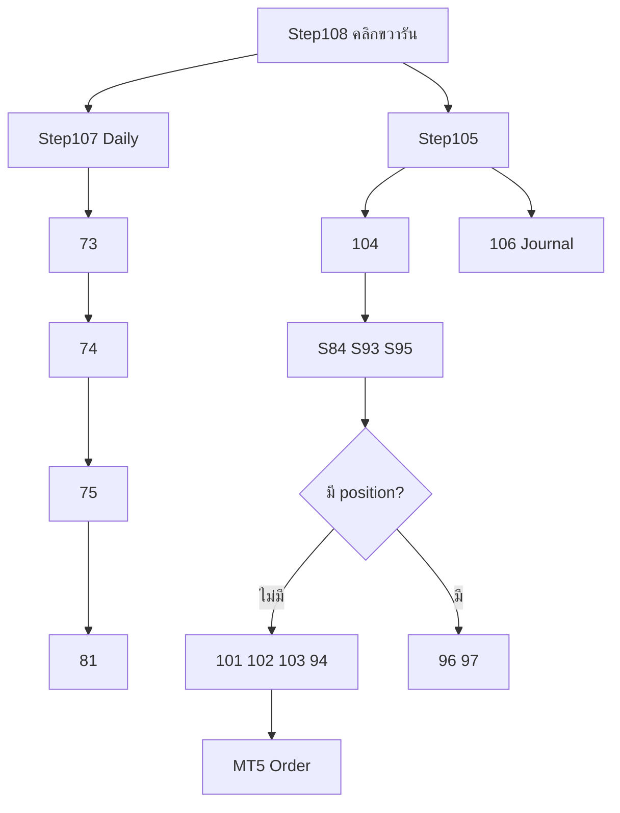
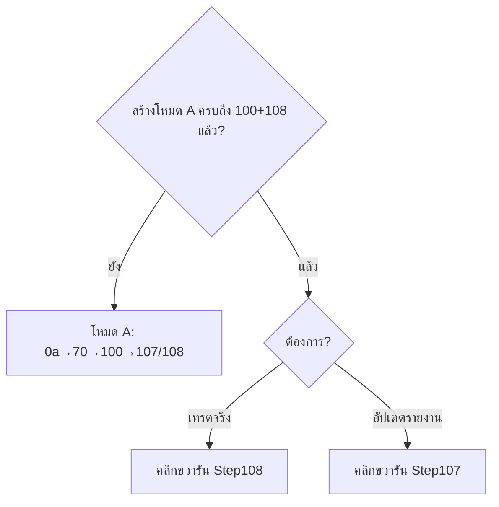

# XAUUSD GOLD V2 — แผนที่ผู้ใช้ (User FlowChart)

> **โฟลเดอร์:** หลัก (root) | **อัปเดต:** กรกฎาคม 2026 | **สำหรับ:** มือใหม่

---

## อ่านใน 30 วินาที

| โหมด | เมื่อไหร่ | รันอะไรหลักๆ |
|------|----------|--------------|
| **A — สร้างและทดสอบระบบ** | ครั้งแรก / retrain / ก่อน live | สร้างโมเดล 0a→70 Freeze แล้ว**สร้างและเทสระบบถึง Step100** จากนั้นเพิ่ม 107/108 |
| **B — รันจริง / เปิดออเดอร์** | ทุกวัน / 24 ชม. (หลัง A เสร็จ) | **คลิกขวารัน Step108** |

```mermaid
flowchart LR
    subgraph A1[\โหมด A — สร้างโมเดล\]
        H1[XAUUSD_H1.csv] --> R[Step 0a-68]
        R --> F[Step70 Freeze]
        F --> PKL[FrozenModel.pkl]
    end
    subgraph A2[\โหมด A — สร้างระบบถึง 100\]
        PKL --> G[Step 73-100]
        G --> P101[Step 101-106]
        P101 --> AUTO[Step 107-108]
    end
    subgraph B[\โหมด B — ใช้งานจริง\]
        AUTO --> RUN[คลิกขวารัน 108]
        RUN --> MT5[MT5 Order]
    end
```

> **สำคัญ:** โหมด A ไม่ได้จบที่ Step72 — ต้องสร้างไฟล์และเทสรันไปจนถึง **Step100** ก่อน แล้วค่อยเพิ่ม **Step107/108** ให้เป็นระบบอัตโนมัติ → ถึงตอนนั้นถึงจะเข้าโหมด B ได้

---

## ไฟล์สำคัญ (ไม่ใช่ Step)

| ไฟล์ | อธิบาย (ทำอะไร / เพื่ออะไร) |
|------|---------------------------|
| `XAUUSD_MarketDataConfig.py` | กฎกลาง (SSOT) กำหนด REPLAY/PAPER/LIVE และ path ข้อมูล H1 — Step84,101,104,105,106 อ่านร่วมกัน ไม่ใช่ไฟล์ที่รันแยก แต่กำหนดว่าระบบทำงานโหมดไหน |
| `XAUUSD_H1.csv` | ข้อมูลแท่งเทียน H1 หลัก อ่านอย่างเดียว เป็นฐานของการเทรนโมเดลและวิเคราะห์ |
| `XAUUSD_FrozenModel.pkl` | โมเดล XGBoost ที่ freeze แล้ว ใช้ตัดสินใจ BUY/SELL ห้าม retrain ใน loop รันจริง |
| `XAUUSD_FrozenFeatures.csv` | รายชื่อ Feature 24 ตัวที่โมเดลใช้ ต้องตรงกับตอนเทรน |
| `XAUUSD_FrozenConfig.json` | Threshold, เวอร์ชัน, วันที่ train เป็นหลักฐานว่าใช้โมเดลชุดไหน |
| `XAUUSD_LiveShadowTrades.csv` | บันทึก trade จำลอง (forward) สะสมจาก Step73 ใช้ตรวจว่าระบบยังทำกำไรได้ไหม |
| `XAUUSD_Step106_LiveDecisionJournal.csv` | บันทึกการตัดสินใจถาวร (append) จาก Step106 ใช้ audit ย้อนหลัง |

**MarketDataConfig:** REPLAY=CSV offline | PAPER=MT5+DEMO | LIVE=MT5+บัญชีจริง

---

## โหมด A — สร้างและทดสอบ (ไม่รันทุกวัน)

### ภาพรวม 3 ช่วงก่อนเข้าโหมด B

```mermaid
flowchart TD
    START([เริ่ม: XAUUSD_H1.csv]) --> P1

    subgraph P1[\"ช่วง 1 — สร้างโมเดล (0a→70)\"]
        S0a[0a] --> S68[68] --> S70[70 FREEZE]
    end

    P1 --> P2

    subgraph P2[\"ช่วง 2 — สร้างระบบ Live (71→100)\"]
        S71[71-72 Governance] --> S73[73-81 Daily Gov]
        S73 --> S82[82-92 Deploy]
        S82 --> S93[93-100 Pipeline+Cert]
    end

    P2 --> P3

    subgraph P3[\"ช่วง 3 — อัตโนมัติ (101→108)\"]
        S101[101-106 Trading parts] --> S107[107 Daily runner]
        S107 --> S108[108 Production runner]
    end

    P3 --> READY([พร้อมโหมด B])
```

| ช่วง | Step | เป้าหมาย |
|------|------|----------|
| **1** | 0a → 70 | สร้างและ freeze โมเดล ML |
| **2** | 71 → 100 | สร้าง governance, deployment, execution, certification ครบวงจร |
| **3** | 101 → 108 | ประกอบ trading loop + สร้าง runner อัตโนมัติ (107/108) |

---

### ช่วง 1 — สร้างและยืนยันโมเดล (Step 0a → 70)

| Step | ไฟล์ | อธิบาย (ทำอะไร / เพื่ออะไร) |
|------|------|---------------------------|
| 0a | `XAUUSD_XGBoost_Analysis.py` | สร้าง ML baseline ครั้งแรก ทดสอบ TP/SL และ Feature Importance เพื่อรู้ว่า XGBoost ใช้ได้กับข้อมูล XAUUSD หรือไม่ |
| 0b | `XAUUSD_XGBoost_DeepAnalysis.py` | วินิจฉัยลึกหลัง 0a หาจุดอ่อน/จุดแข็งของ baseline ก่อนพัฒนาต่อเป็น Model C |
| 1 | `XAUUSD_Step1_FeatureCheck.py` | ตรวจและแก้ Feature ผิดปกติ (เช่น Wick outlier) เทียบ Model A vs B เพื่อให้ข้อมูลเข้าโมเดลสะอาด |
| 2 | `XAUUSD_Step2_FeatureQuality.py` | แยก Feature ที่เป็น Signal จริง vs Noise เพื่อไม่เอา Feature ขยะเข้าโมเดล |
| 3a | `XAUUSD_Step3_MarketStructure.py` | สร้าง Market Structure Features 12 ตัว และ Model C ซึ่งเป็นโมเดลหลักที่ใช้ต่อ |
| 3b | `XAUUSD_Step3_InteractionAnalysis.py` | วิเคราะห์ Feature ที่ทำงานร่วมกันได้ดี เพื่อเลือกชุด Feature ที่มีพลังจริง |
| 3c | `XAUUSD_Step3_Stability.py` | ตรวจว่า Combination ที่ดีใน Train ยังดีใน Test หรือไม่ ป้องกัน overfit |
| 4 | `XAUUSD_Step4_ModelComparison.py` | เทียบประสิทธิภาพ Model A, B, C อย่างเป็นระบบ เพื่อยืนยันว่า Model C ดีที่สุด |
| 5 | `XAUUSD_Step5_ProbabilityThreshold.py` | หา threshold ความน่าจะเป็น (เช่น 0.69) ที่สมดุลระหว่าง precision กับจำนวน trade |
| 55 | `XAUUSD_Step55_EdgeValidation.py` | Backtest Edge บน Test set เพื่อดูว่ามีกำไรจริงหลังหักต้นทุนหรือไม่ |
| 6 | `XAUUSD_Step6_WalkForwardValidation.py` | Walk-Forward ข้ามหลายเดือน เพื่อพิสูจน์ว่าโมเดล robust ไม่ได้โชคช่วงเดียว |
| 65 | `XAUUSD_Step65_FailureAnalysis.py` | วิเคราะห์เดือนที่ระบบแพ้ เพื่อเข้าใจว่าแพ้เพราะอะไร และจะกรองอย่างไร |
| 66 | `XAUUSD_Step66_RegimeAnalysis.py` | วิเคราะห์ Regime ตลาด (Vol/Trend/Session) เพื่อรู้ว่าควรเทรดช่วงไหน |
| 67 | `XAUUSD_Step67_FilterValidation.py` | ทดสอบ Filter A–H ว่าตัวไหนช่วยเพิ่ม PF/Expectancy จริง เพื่อเลือก Filter ใช้ live |
| 68 | `XAUUSD_Step68_FinalOOSValidation.py` | OOS ครั้งเดียวสุดท้าย ยืนยันผลก่อน freeze — ห้ามปรับ parameter หลังนี้ |
| 69 | `XAUUSD_Step69_MonteCarloValidation.py` | Monte Carlo สลับลำดับ trade เพื่อดู Order Risk ว่าผลลัพธ์พึ่งลำดับโชคหรือไม่ |
| 610 | `XAUUSD_Step610_BootstrapMonteCarlo.py` | Bootstrap MC ทดสอบ Distribution Risk ของ equity curve |
| 70 | `XAUUSD_Step70_ForwardValidationFramework.py` | **Freeze Model** สร้าง `.pkl` + config ถาวร และเริ่ม forward monitoring บนข้อมูลใหม่ |

---

### ช่วง 2 — สร้างระบบ Live ครบวงจร (Step 71 → 100)

> หลัง Freeze แล้ว ต้องสร้างและเทสรัน Step เหล่านี้จนครบ **ถึง 100** ก่อนเข้าโหมด B — ช่วงนี้เป็นการ \"ประกอบร่างระบบ\" ไม่ใช่รันทุกวัน

| Step | ไฟล์ | อธิบาย (ทำอะไร / เพื่ออะไร) |
|------|------|---------------------------|
| 71 | `XAUUSD_Step71_DriftRootCauseAnalysis.py` | วิเคราะห์สาเหตุ PSI Drift หลัง deploy เพื่อรู้ว่าโมเดลเสื่อมเพราะอะไร (feature เปลี่ยน/regime เปลี่ยน) |
| 72 | `XAUUSD_Step72_LiveDeploymentReadiness.py` | Checklist ความพร้อมก่อน live รวบรวมหลักฐานจาก Step68/70/71 ตอบได้ว่า \"พร้อมเทรดจริงหรือยัง\" |
| 73 | `XAUUSD_Step73_LiveShadowTradingFramework.py` | Shadow/Paper forward บน Frozen Model บันทึกลง Shadow Log เพื่อติดตามผลโดยไม่เสี่ยงเงินจริง |
| 74 | `XAUUSD_Step74_LiveMonitoringDashboard.py` | Dashboard สุขภาพระบบ เทียบ WR/PF/DD กับ baseline Step68 เพื่อรู้ว่าระบบยังปกติไหม |
| 75 | `XAUUSD_Step75_LiveTradingDecisionEngine.py` | **ตอบคำถามหลัก: ควรเทรดต่อ / หยุด / retrain?** อ่านผล 73/74/71 แล้วให้คำตอบ CONTINUE/STOP/RETRAIN |
| 76 | `XAUUSD_Step76_WalkForwardRetrainFramework.py` | วางแผน retrain เมื่อ drift รุนแรง กำหนดกฎ acceptance ก่อนเปลี่ยนโมเดล |
| 77 | `XAUUSD_Step77_SystemAuditAndCertification.py` | Audit 10 ข้อ + ใบรับรองระบบ เป็นหลักฐานว่า pipeline ถูกต้องตามมาตรฐาน |
| 78 | `XAUUSD_Step78_PortfolioAndCapitalManagementSimulator.py` | จำลอง growth พอร์ตจาก Shadow Log เพื่อดู drawdown และความเสี่ยงระดับพอร์ต |
| 79 | `XAUUSD_Step79_LiveTradingOperationsPlaybook.py` | คู่มือปฏิบัติการ (SOP) สำหรับ operator ว่าทำอะไรเมื่อเกิดเหตุการณ์ต่างๆ |
| 80 | `XAUUSD_Step80_ScenarioValidationFramework.py` | ทดสอบ logic Step75-79 ด้วยข้อมูล synthetic พิสูจน์ว่า decision engine ตอบถูก |
| 81 | `XAUUSD_Step81_AutomatedLiveOperationsScheduler.py` | สรุปสถานะระบบจาก Step74-80 เป็นรายงาน executive ก่อนเริ่มวัน |
| 82 | `XAUUSD_Step82_ProductionDeploymentReadiness.py` | Gate สุดท้ายก่อน production ตรวจว่าไฟล์/โมเดล/CSV ครบและพร้อม |
| 83 | `XAUUSD_Step83_LiveDeploymentArchitecture.py` | เอกสารสถาปัตยกรรม + คู่มือ operator อธิบายว่าระบบเชื่อมกันอย่างไร |
| 84 | `XAUUSD_Step84_AutoOperationsController.py` | **SSOT การตัดสินใจเทรด** อ่าน H1/MT5 แล้วตอบว่าวันนี้เทรดได้ไหม Filter ไหน Emergency หรือไม่ |
| 85 | `XAUUSD_Step85_AutoSchedulerAndWorkflowManager.py` | ตาราง workflow รายวัน กำหนดลำดับและเวลารันแต่ละ Step |
| 86 | `XAUUSD_Step86_AutomatedExecutionPreparationFramework.py` | เตรียม execution ก่อนส่ง order ตรวจ checklist ครบก่อนเปิดออเดอร์ |
| 87 | `XAUUSD_Step87_OrderSimulationManager.py` | ชั้นจำลอง order ทดสอบ flow เปิด-ปิดโดยไม่ส่งจริง |
| 88 | `XAUUSD_Step88_MockBrokerGatewayAndTransmissionController.py` | Mock broker gateway ทดสอบการส่งคำสั่งแบบจำลอง |
| 89 | `XAUUSD_Step89_TradeLifecycleSimulator.py` | จำลอง lifecycle ทั้ง trade ตั้งแต่เปิดถึงปิด |
| 90 | `XAUUSD_Step90_PortfolioAndPerformanceAggregator.py` | รวมผล performance หลาย filter/trade เป็นภาพพอร์ต |
| 91 | `XAUUSD_Step91_TradeRepositoryManager.py` | ฐานข้อมูล trade ประวัติ เก็บและจัดการข้อมูลย้อนหลัง |
| 92 | `XAUUSD_Step92_MasterDashboardAndCommandCenter.py` | Dashboard รวมศูนย์ ดูสถานะทุกส่วนในที่เดียว |
| 93 | `XAUUSD_Step93_DemoBrokerConnectivityValidator.py` | ตรวจ MT5 เชื่อมต่อ login symbol spread ก่อนส่ง order |
| 94 | `XAUUSD_Step94_DemoOrderExecutionController.py` | ส่งออเดอร์จริงผ่าน MT5 + ML Signal Gate ตรวจสัญญาณจาก Shadow Log |
| 95 | `XAUUSD_Step95_PositionMonitoringAndTradeStateTracker.py` | ตรวจ position เปิดอยู่หรือไม่ สถานะ P/L spread เพื่อเลือก branch เปิดหรือปิด |
| 96 | `XAUUSD_Step96_PositionExitAndTradeClosureController.py` | Monitor position ที่เปิดอยู่ รอ TP/SL จาก broker (ไม่ส่ง close เอง) |
| 97 | `XAUUSD_Step97_RealTradeHistoryCollectorAndRepositorySynchronizer.py` | ดึง history จาก MT5 หลังปิดออเดอร์ sync กับ repository |
| 98 | `XAUUSD_Step98_RealPerformanceAnalyticsAndEquityCurveEngine.py` | วิเคราะห์ผลจริง + equity curve จาก trade ที่ปิดแล้ว |
| 99 | `XAUUSD_Step99_FinalSystemCertificationAndProductionReadinessAudit.py` | Audit สุดท้ายก่อน production ยืนยันทุกชั้นพร้อม |
| 100 | `XAUUSD_Step100_MasterTradingSystemOrchestrator.py` | Orchestrator รวมศูนย์ pipeline ทดสอบการทำงานร่วมกันทุกส่วน |

---

### ช่วง 3 — ประกอบอัตโนมัติ (Step 101 → 108)

> หลัง Step100 แล้ว ประกอบ trading loop (101-106) และสร้าง **runner** (107/108) เพื่อไม่ต้องรันทีละ Step อีกต่อไป

| Step | ไฟล์ | อธิบาย (ทำอะไร / เพื่ออะไร) |
|------|------|---------------------------|
| 101 | `XAUUSD_Step101_ExecutionPolicyEngine.py` | นโยบายก่อนเปิดออเดอร์ ตรวจว่า policy อนุญาต execute หรือต้องรอ เมื่อไม่มี position |
| 102 | `XAUUSD_Step102_ExecutionWorkflowCoordinator.py` | ประสาน workflow เปิดออเดอร์ รวมผล gate หลายชั้นเป็น workflow state เดียว |
| 103 | `XAUUSD_Step103_LiveExecutionController.py` | Safety gate สุดท้ายก่อนส่ง order ถ้าผ่านครบจึงเรียก Step94 |
| 104 | `XAUUSD_Step104_TradingLoopEngine.py` | Engine หลัก วน loop ทุก cycle เรียก S84→S93→S95 แล้วแยก branch เปิด/ปิด |
| 105 | `XAUUSD_Step105_ProductionSchedulerAndSystemSupervisor.py` | Supervisor ดูแล Step104 ตลอด runtime เรียก Step106 หลังจบ session (ถูกเรียกโดย Step108) |
| 106 | `XAUUSD_Step106_LiveTradeJournalAndDecisionLogger.py` | บันทึก Journal ถาวรทุกการตัดสินใจ append-only ใช้ audit ย้อนหลัง |
| 107 | `XAUUSD_Step107_DailyGovernanceChainRunner.py` | **Runner รายวัน** รวม 73→74→75→81 อัตโนมัติ แทนการรันทีละไฟล์ |
| 108 | `XAUUSD_Step108_ProductionLoopRunner.py` | **Runner Production** เรียก 107 แล้ว 105 — จุดเริ่มมือใหม่ในโหมด B |

---

## โหมด B — รันจริง (หลังสร้าง A ครบแล้ว)

> โหมด B คือ **การใช้งานจริงทุกวัน** — ไม่ต้องรัน Step 0a-100 ซ้ำ (ยกเว้น retrain)



### ตารางโหมด B — สิ่งที่รันจริงทุกวัน

| Step | ไฟล์ | อธิบาย (ทำอะไร / เพื่ออะไร) |
|------|------|---------------------------|
| 108 | `XAUUSD_Step108_ProductionLoopRunner.py` | จุดเริ่มเดียวสำหรับมือใหม่ เรียก 107 (daily) แล้ว 105 (loop 24/7) ไม่ต้องรัน Step อื่นเอง |
| 107 | `XAUUSD_Step107_DailyGovernanceChainRunner.py` | รวม daily 73→74→75→81 อัตโนมัติ refresh shadow log, dashboard, คำตอบว่าควรเทรดต่อไหม |
| 73 | `XAUUSD_Step73_LiveShadowTradingFramework.py` | อัปเดต forward shadow บน Frozen Model append trade ใหม่หลังวันที่ล่าสุดใน log |
| 74 | `XAUUSD_Step74_LiveMonitoringDashboard.py` | อัปเดต dashboard เทียบ baseline ให้เห็นว่า WR/PF/DD ยังอยู่ในเกณฑ์ไหม |
| 75 | `XAUUSD_Step75_LiveTradingDecisionEngine.py` | ตัดสินใจวันนี้ CONTINUE / STOP / RETRAIN จากข้อมูลล่าสุด |
| 81 | `XAUUSD_Step81_AutomatedLiveOperationsScheduler.py` | สรุป executive สถานะระบบก่อนเข้า production loop |
| 105 | `XAUUSD_Step105_ProductionSchedulerAndSystemSupervisor.py` | ดูแล Step104 restart เมื่อล้ม เรียก Step106 หลังจบแต่ละ session |
| 104 | `XAUUSD_Step104_TradingLoopEngine.py` | วน trading loop ทุก ~60 วิ เรียก pipeline ตาม branch เปิด/ปิด position |
| 84 | `XAUUSD_Step84_AutoOperationsController.py` | อัปเดต SSOT ทุก cycle — วันนี้เทรดได้ไหม Filter อะไร Emergency หรือไม่ |
| 93 | `XAUUSD_Step93_DemoBrokerConnectivityValidator.py` | ตรวจ MT5 ทุก cycle ว่ายังเชื่อมต่อและพร้อมส่ง order |
| 95 | `XAUUSD_Step95_PositionMonitoringAndTradeStateTracker.py` | ตรวจว่ามี position เปิดอยู่หรือไม่ เพื่อเลือก branch ENTRY หรือ EXIT |
| 101 | `XAUUSD_Step101_ExecutionPolicyEngine.py` | Gate นโยบายก่อนเปิด — อนุญาต execute หรือไม่ |
| 102 | `XAUUSD_Step102_ExecutionWorkflowCoordinator.py` | ประสาน workflow รวมผล gate เป็นสถานะเดียว |
| 103 | `XAUUSD_Step103_LiveExecutionController.py` | Safety สุดท้ายก่อนส่ง order ผ่านครบจึงเรียก 94 |
| 94 | `XAUUSD_Step94_DemoOrderExecutionController.py` | ส่งออเดอร์จริง MT5 หลัง ML Signal Gate ผ่าน (PAPER=DEMO, LIVE=จริง) |
| 96 | `XAUUSD_Step96_PositionExitAndTradeClosureController.py` | Monitor position รอ TP/SL จาก broker |
| 97 | `XAUUSD_Step97_RealTradeHistoryCollectorAndRepositorySynchronizer.py` | Sync history หลัง broker ปิดออเดอร์ |
| 106 | `XAUUSD_Step106_LiveTradeJournalAndDecisionLogger.py` | บันทึก journal ถาวรหลังจบแต่ละ session |


### ไฟล์ที่ได้เมื่อกด Step108 — อ้างอิงด่วน

> **ไม่ใช่แค่ log 107/108** — กด Step108 หนึ่งครั้ง ระบบสร้าง/อัปเดตไฟล์หลายชั้น แบ่งเป็น 4 กลุ่มด้านล่าง

#### กลุ่ม 1 — Log รอบรัน (สร้างไฟล์ใหม่ทุกครั้ง มีวันที่เวลา)

| ไฟล์ | ตัวอย่าง | อธิบาย (ทำอะไร / เพื่ออะไร) |
|------|---------|---------------------------|
| `XAUUSD_Step108_run_production_YYYYMMDD_HHMMSS.txt` | `..._20260705_093015.txt` | log หลักของรอบนั้น — บันทึก stdout ทั้งหมดตั้งแต่ 107 จนจบ 105 |
| `XAUUSD_Step107_run_daily_YYYYMMDD_HHMMSS.txt` | `..._20260705_092958.txt` | log แยกของช่วง Daily (73→81) แม้ถูกเรียกจาก 108 |

#### กลุ่ม 2 — ไฟล์สะสม (สำคัญที่สุดสำหรับติดตามระยะยาว)

| ไฟล์ | Step ที่เขียน | อธิบาย (ทำอะไร / เพื่ออะไร) |
|------|--------------|---------------------------|
| `XAUUSD_LiveShadowTrades.csv` | 73 | สะสม shadow trade ทุกวัน — input ของ Step94 |
| `XAUUSD_Step106_LiveDecisionJournal.csv` | 106 | บันทึกการตัดสินใจถาวรแบบ append-only |
| `XAUUSD_TradeRepository.csv` | 97 | สะสมประวัติดีลจริงจาก MT5 หลังปิดออเดอร์ |
| `Live/XAUUSD_H1_Live.csv` | 84 | อัปเดตราคา H1 จาก MT5 (โหมด PAPER/LIVE) |

#### กลุ่ม 3 — ผลลัพธ์ Daily Chain (ทับชื่อเดิมทุกครั้งที่รัน 107)

| Step | ไฟล์ที่ได้ | อธิบาย (ทำอะไร / เพื่ออะไร) |
|------|-----------|---------------------------|
| 73 | `.csv`, `.png`, `XAUUSD_Step73_RunStatus.csv` | สรุปรอบ shadow forward ล่าสุด |
| 74 | `.csv`, `.png` | Dashboard สุขภาพระบบ |
| 75 | `.csv`, `.png` | **คำตอบหลัก: CONTINUE / STOP / RETRAIN** |
| 81 | `.csv`, `.png`, `XAUUSD_Step81_ExecutiveSummary.txt` | สรุป executive ก่อนเข้า production loop |

#### กลุ่ม 4 — ผลลัพธ์ Production Loop (ทับชื่อเดิมทุกครั้งที่รัน 105→104)

| Step | ไฟล์ที่ได้ | เมื่อไหร่ที่ได้ |
|------|-----------|----------------|
| 84, 93, 95 | `.csv`, `.png`, `.txt` | ทุก cycle |
| 101–103, 94 | `.csv`, `.png`, `.txt` | ไม่มี position + ผ่าน gate |
| 96, 97 | `.csv`, `.png`, `.txt` | มี position / หลังปิด |
| 104, 105, 106 | `.csv`, `.png`, `.txt` | ทุก session |

#### อยากรู้อะไร → เปิดไฟล์ไหน

| คำถาม | เปิดไฟล์นี้ |
|--------|------------|
| วันนี้ควรเทรดต่อไหม? | `XAUUSD_Step75_LiveTradingDecisionEngine.csv` |
| ระบบยัง healthy ไหม? | `XAUUSD_Step74_LiveMonitoringDashboard.csv` / `.png` |
| สรุปก่อนเริ่มวัน | `XAUUSD_Step81_ExecutiveSummary.txt` |
| วันนี้เทรดได้ไหม / Emergency? | `XAUUSD_Step84_AutoOperationsController.csv` |
| MT5 พร้อมไหม? | `XAUUSD_Step93_DemoBrokerConnectivityValidator.csv` |
| มีออเดอร์เปิดอยู่ไหม? | `XAUUSD_Step95_PositionMonitoringAndTradeStateTracker.csv` |
| ส่ง order สำเร็จไหม? | `XAUUSD_Step94_DemoOrderExecutionController.csv` |
| บันทึกการตัดสินใจย้อนหลัง | `XAUUSD_Step106_LiveDecisionJournal.csv` |
| ประวัติดีลจริงสะสม | `XAUUSD_TradeRepository.csv` |
| Shadow trade สะสม | `XAUUSD_LiveShadowTrades.csv` |
| รันแล้ว error ดูตรงไหน? | `XAUUSD_Step108_run_production_YYYYMMDD_HHMMSS.txt` (ล่าสุด) |

> **หมายเหตุ:** กลุ่ม 3–4 **ทับชื่อเดิม** | กลุ่ม 1–2 **สะสม**

---

## คลิกขวารันวินโดว์

| ต้องการ | ไฟล์ |
|---------|------|
| Production เต็ม (โหมด B) | `XAUUSD_Step108_ProductionLoopRunner.py` |
| Daily อย่างเดียว | `XAUUSD_Step107_DailyGovernanceChainRunner.py` |

ลำดับ Step108: **107 (73-81) → 105 → 104 loop → 106** ทุก ~60 วิ

---

## Log หลังรัน (รูปแบบชื่อไฟล์)

> รายละเอียดไฟล์ทั้งหมดที่ได้เมื่อกด Step108 ดูที่หัวข้อ **「ไฟล์ที่ได้เมื่อกด Step108 — อ้างอิงด่วน」** ด้านบน

| รูปแบบชื่อไฟล์ | ตัวอย่างจริง | จาก Step |
|--------------|-------------|----------|
| `XAUUSD_Step107_run_daily_YYYYMMDD_HHMMSS.txt` | `XAUUSD_Step107_run_daily_20260704_212048.txt` | Step107 |
| `XAUUSD_Step108_run_production_YYYYMMDD_HHMMSS.txt` | `XAUUSD_Step108_run_production_20260704_093015.txt` | Step108 |
| `XAUUSD_StepNN_*.csv` / `.png` / `.txt` | `XAUUSD_Step104_TradingLoopEngine.csv` | แต่ละ Step |

- `YYYYMMDD` = วันที่รัน (เช่น 20260704 = 4 ก.ค. 2026)
- `HHMMSS` = เวลารัน (เช่น 212048 = 21:20:48)
- กด Step108 หนึ่งครั้ง → ได้ log timestamp **อย่างน้อย 2 ไฟล์** (108 + 107) + ไฟล์ CSV/PNG/TXT ของแต่ละ Step + ไฟล์สะสม

Log ps1 เก่า: `archive/run_logs_legacy/`

---

## สรุปเร็ว



## กฎสำคัญ

1. โหมด A ไม่รันทุกวัน — สร้างครั้งเดียวจนถึง 100 แล้วเพิ่ม 107/108
2. โหมด B เริ่ม Step108 — 107 ถูกเรียกอัตโนมัติ
3. Frozen Model ห้าม retrain ใน loop รันจริง
4. Step75 ตอบว่าควรเทรดต่อไหม | Step84 = SSOT | Step94 = ส่ง order
5. MarketDataConfig = กฎ REPLAY/PAPER/LIVE กลาง

*ประมาณ 7-9 หน้า A4 (รวมตารางอ้างอิงไฟล์แล้ว)*
